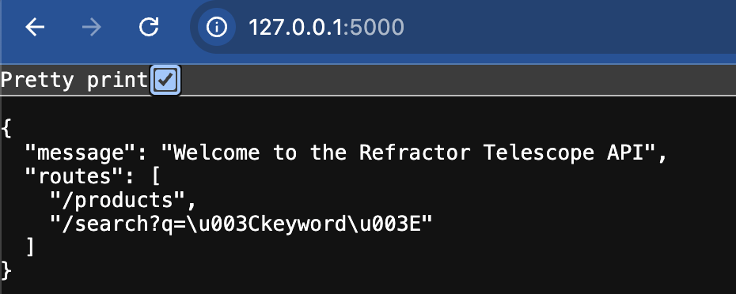
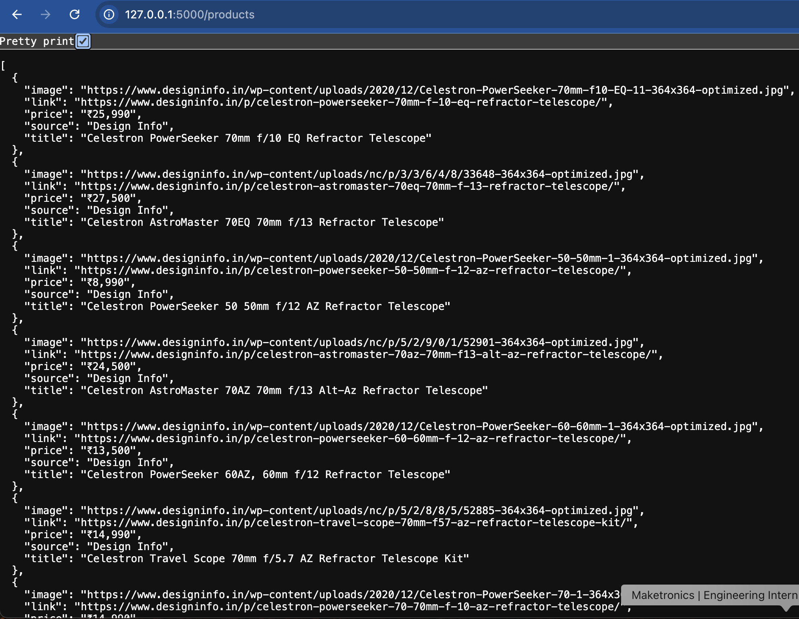
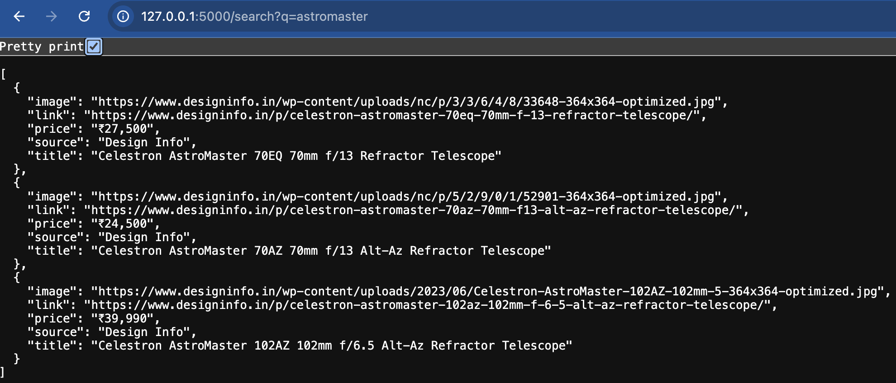
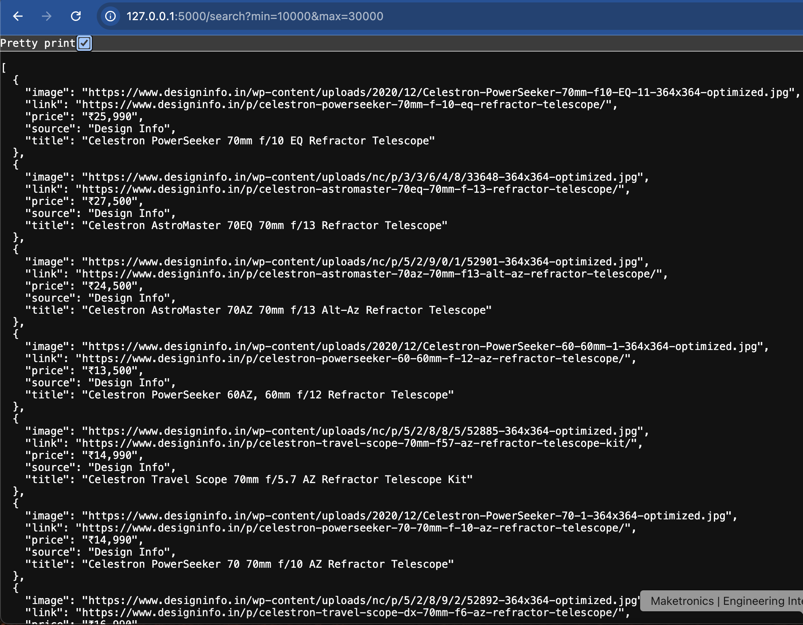

# 🔭 Refractor Telescopes Scraper API

This Flask API scrapes refractor telescopes from two websites and serves the data via `/products` and `/search` endpoints.

## Features
- Scrapes live data from:
  - [designinfo.in](https://www.designinfo.in)
  - [moderntelescopes.net](https://moderntelescopes.net)
- Provides API endpoints to:
  - View all telescopes
  - Search by keyword

## Folder Structure
telescopes-scraping-api/
├── app/
│   ├── main.py
│   └── scraper.py
├── data/
│   └── products.json
├── output-screenshots/  
│   ├── home.png
│   ├── products.png
│   └── search-celestron.png
├── requirements.txt
├── Procfile
└── README.md

## Setup Instructions
1. Clone and Install
```bash
git clone https://github.com/your-username/telescopes-scraping-api.git
cd telescopes-scraping-api
python3 -m pip install -r requirements.txt
```
2. Run the API in your project directory
```bash
python3 app/main.py
```
3. Visit:
http://127.0.0.1:5000/products
http://127.0.0.1:5000/search?q=70mm

## Sample Outputs

### Home (`/`)


### All Products (`/products`)


### Search Results for "astromaster"


### Search Results for price between Rs. 10,000 and Rs. 30,000


### Assumptions
- Websites do not have anti-scraping protections
- Content structure (HTML) remains stable
- Dynamic content (e.g., JS-loaded) is handled using Selenium

### Deployment (Optional)
Create a Procfile with:
```txt
web: python3 app/main.py
```
Then deploy to Render or Heroku.

### Bonus Ideas
- Cache JSON output
- Add frontend display (React)